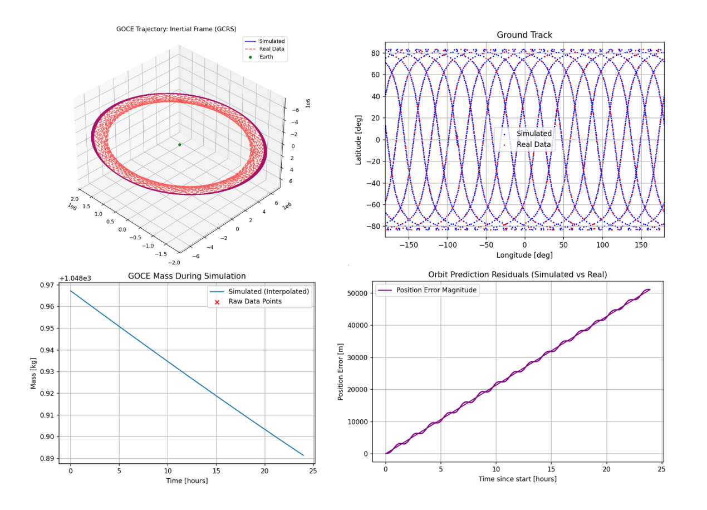

# GOCE Satellite Orbit Propagation Simulation

## Overview

This project performs an orbit propagation of the **GOCE** (*Gravity Field and Steady-State Ocean Circulation Explorer*) satellite using the `tudatpy` orbital mechanics library and compares it to data available from the ESA website here [ESA GOCE Mass Properties](https://earth.esa.int/eogateway/missions/data/goce-mass-properties).

A key feature of this simulation is the realistic modelling of the satellite's mass. Instead of a constant mass, this script loads real mission data from the `GOCE-Mass-Properties.txt` file, interpolates it, and uses the resulting function to model the satellite's decreasing mass over time (due to propellant consumption).
It also takes into account orbital pertubations, modelling spherical harmonic gravity using the gcrs_to_itrs rotation model for the Earth and taking into account the atmosphere and aerodynamic drag- important since GOCE is an LEO satellite. I have just added in Solar Radiation Pressure (SRP) too, currently modelling GOCE as a cannonball- I will likely change this to a panelled target in future versions. Relativistic correction to acceleration has been added for completeness, it's effect is minimal- uses Schwarzchild and de Sitter contributions. 

**IMPORTANT:**  to run the `varying_mass_GOCE_plot.py` script you need to download the `parameters.ini` file (containing the parameters) and `GOCE-Mass-Properties` (containting the mass data). `parameters.ini` acts as the configuration file. 


**MORE IMPORTANT:** I have done quite a bit of work behind the scenes and haven't updated this README... oops! Anyway, I downloaded actual GOCE data from [ESA GOCE Level 2](https://earth.esa.int/eogateway/catalog/goce-level-2), specifically the SST_PSO_2_ data. Since I only have 4GB RAM I wrote some code to process this file (`create_actual_data_file.py`), and generate a csv file (`goce_orbit_data.csv`) that will contain around 1% of the positions from the GOCE data. I have uploaded an example for ease of use. I then plotted this actual GOCE data onto my existing plots. I realised at this point that using the parameters that I initially found were not going to work- so I used the first two data points to estimate the initial velocity and hence the initial orbital elements as a best guess, then used this best guess to calculate an impoved initial velocity using minimize from scipy.optimize. I then calculated and plotted the residuals. This updated code is in `comparison_plots.py`, and this is the one that you should run!

## Key Features

* **Orbit Propagation**: Uses tudatpy to simulate the satellite's trajectory.
* **Variable Mass Modelling**: Loads and interpolates real GOCE mass data to provide a time-varying mass to the propagator. This is cool since thrust and drag have a greater effect as mass decreases, and we are modelling this decrease in mass.
* **Monotonic Interpolation**: Uses `scipy.interpolate.PchipInterpolator` to ensure the mass function is monotonically decreasing, since there are some long gaps in our mass data that can affect interpolation.
* **Comprehensive Force Model**:
    * **Earth**: Spherical harmonic gravity (J2) (up to degree 12, order 6), taking into account the fact that the Earth is not perfectly spherical.
    * **Moon & Sun**: Third bodies, considers as point-mass sources.
    * **Atmosphere**: `NRLMSISE-00` atmospheric model for Earth.
    * **Aerodynamics**: Constant drag and lift coefficients to quantify effect of atmosphere on LEO.
    * **Solar Radiation Pressure (SRP)**: Models the acceleration on the satellite due to photons from Sun transferring momentum.
    * **Relativistic Correction**: Models the Schwarzchild and de Sitter contributions to GOCE acceleration.
* **Detailed plots of data**: Generates three key plots using `matplotlib`:
    1.  **3D Trajectory**: A 3D plot of the GOCE orbit around the Earth.
    2.  **Ground Track**: A 2D plot of the satellite's ground track for the first 3 hours, easily changeable.
    3.  **Mass vs. Time**: A plot showing the satellite's mass decreasing over the simulation period, overlaid with the original raw data points from the mass file to validate the interpolation.
    4.  **Actual data**: Plots the actual GOCE trajectory data and calculates residuals for side by side comparison.

## Things Used

* **Python 3**
* **`tudatpy`**: For all orbital mechanics, environment setup, and propagation.
* **`scipy`**: For mass data interpolation.
* **`pandas`**: For loading and parsing the mass data file.
* **`numpy`**: For numerical operations and data handling.
* **`matplotlib`**: For all data visualization.
* **`configparser`**: To run `parameters.ini` as the configuration file.

## How to Run

### 1. Prerequisites

Ensure you have Python 3 and the following libraries installed:

```bash
pip install tudatpy
pip install pandas
pip install numpy
pip install matplotlib
pip install scipy
```

You are going to need to be in the tudat-space environment. For more information on tudat installation, see here: [tudat installation](https://docs.tudat.space/en/latest/getting-started/installation.html#getting-started-installation)

### 2. Data File

You **must** have the `GOCE-Mass-Properties.txt` file in the same directory as the Python script. This file contains the raw mass data required for the simulation. You can download it from this repository, or the ESA link at the beginning of this README.

### 3. SPICE Kernels

The script uses `spice.load_standard_kernels()` to load standard SPICE kernels. `tudatpy` will typically download these automatically if they are not found.

### 4. Execute the Script

*Added easily changable parameters (for experimentation!)*

You will need to download the `comparison_plots.py` script, alongside the `parameters.ini` file, `GOCE-Mass-Properties.txt` and `GOCE_orbit_data.csv`. You can change the parameters directly within this .ini file, and run whatever orbit data you want- the one in this reposititory is given as an example. Make sure you are in the tudat-space envionment.

### 5. View Results

The script will print simulation details to the console, including initial/final mass and state vectors. It will then display the plots (3D trajectory, ground track, and mass over time, and residuals if you are using the comparison plots).
Congratulations, it worked!

### 6. Example Plots

The below plots are an example of this new comparison code- they use data from the GO_CONS_SST_PSO_2__20091001T235945_20091002T235944_0201.DBL, which has been processed and is in this repository as `goce_orbit_data.csv`- data from the 1st October 2009. They use the parameters and mass data from this repository. The Mean Position Error (residual) was 25572.94 m for this example. You can see visually that our period is a bit off-look at the curvy residual plot- but that the approximation is relatively good- the blue and red are combining to make purple!


*Note: not all numbers are accurate to GOCE, some are placeholders/approximations for the meantime. I am doing plenty of research, some of this stuff is a little tricky to find!*
